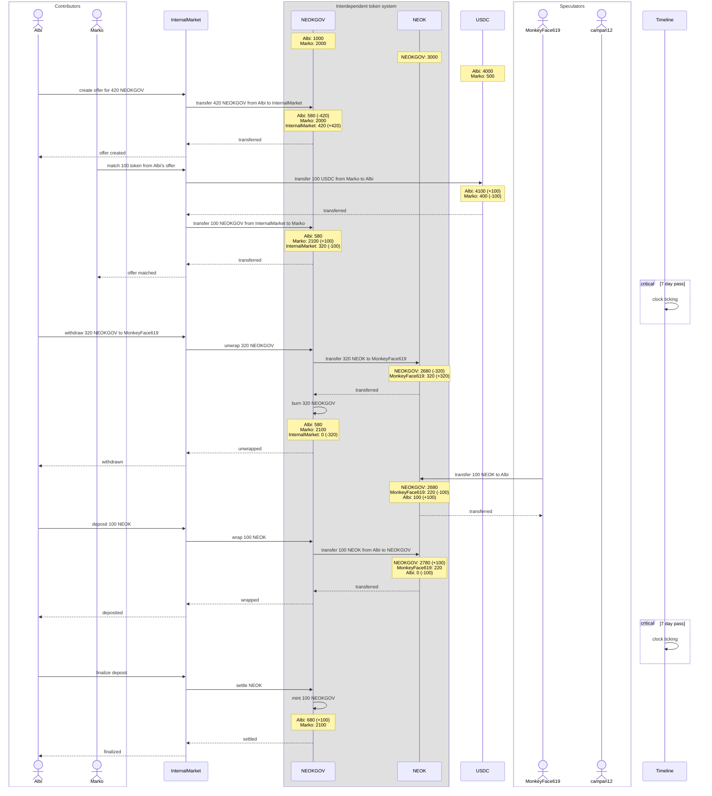

```mermaid
sequenceDiagram

    box Contributors
        actor Albi
        actor Marko
    end

    participant InternalMarket

    box rgb(224,224,224) Interdependent token system
        participant NEOKGOV
        participant NEOK
    end

    participant USDC

    box Speculators
        actor MonkeyFace619
        actor campari12
    end

    %% Initial conditions
    Note over NEOKGOV: Albi: 1000<br>Marko: 2000
    Note over NEOK: NEOKGOV: 3000
    Note over USDC: Albi: 4000<br>Marko: 500

    %% Albi creates an offer
    Albi->>InternalMarket: create offer for 420 NEOKGOV
    InternalMarket->>NEOKGOV: transfer 420 NEOKGOV from Albi to InternalMarket
    Note over NEOKGOV: Albi: 580 (-420)<br>Marko: 2000<br>InternalMarket: 420 (+420)
    NEOKGOV-->>InternalMarket: transferred
    InternalMarket-->>Albi: offer created

    %% Marko partially matches Albi's offer
    Marko->>InternalMarket: match 100 token from Albi's offer
    InternalMarket->>USDC: transfer 100 USDC from Marko to Albi
    Note over USDC: Albi: 4100 (+100)<br>Marko: 400 (-100)
    USDC-->>InternalMarket: transferred
    InternalMarket->>NEOKGOV: transfer 100 NEOKGOV from InternalMarket to Marko
    Note over NEOKGOV: Albi: 580<br>Marko: 2100 (+100)<br>InternalMarket: 320 (-100)
    NEOKGOV-->>InternalMarket: transferred
    InternalMarket-->>Marko: offer matched

    %% Moving towards the heat death of the universe
    critical 7 day pass
        Timeline->>Timeline: clock ticking
    end

    %% Albi can now withdraw the remaining tokens
    Albi->>InternalMarket: withdraw 320 NEOKGOV to MonkeyFace619
    InternalMarket->>NEOKGOV: unwrap 320 NEOKGOV
    NEOKGOV->>NEOK: transfer 320 NEOK to MonkeyFace619
    Note over NEOK: NEOKGOV: 2680 (-320)<br>MonkeyFace619: 320 (+320)
    NEOK-->>NEOKGOV: transferred
    NEOKGOV->>NEOKGOV: burn 320 NEOKGOV
    Note over NEOKGOV: Albi: 580<br>Marko: 2100<br>InternalMarket: 0 (-320)
    NEOKGOV-->>InternalMarket: unwrapped
    InternalMarket-->>Albi: withdrawn

    %% MonkeyFace619 transfers some tokens to Albi
    MonkeyFace619->>NEOK: transfer 100 NEOK to Albi
    Note over NEOK: NEOKGOV: 2680<br>MonkeyFace619: 220 (-100)<br>Albi: 100 (+100)
    NEOK-->>MonkeyFace619: transferred

    %% Albi starts the deposit of 100 tokens
    Albi->>InternalMarket: deposit 100 NEOK
    InternalMarket->>NEOKGOV: wrap 100 NEOK
    NEOKGOV->>NEOK: transfer 100 NEOK from Albi to NEOKGOV
    Note over NEOK: NEOKGOV: 2780 (+100)<br>MonkeyFace619: 220<br>Albi: 0 (-100)
    NEOK-->>NEOKGOV: transferred
    NEOKGOV-->>InternalMarket: wrapped
    InternalMarket-->>Albi: deposited

    %% Moving towards the heat death of the universe
    critical 7 day pass
        Timeline->>Timeline: clock ticking
    end

    %% Albi finalizes the deposit
    Albi->>InternalMarket: finalize deposit
    InternalMarket->>NEOKGOV: settle NEOK
    NEOKGOV->>NEOKGOV: mint 100 NEOKGOV
    Note over NEOKGOV: Albi: 680 (+100)<br>Marko: 2100
    NEOKGOV-->>InternalMarket: settled
    InternalMarket-->>Albi: finalized
```
